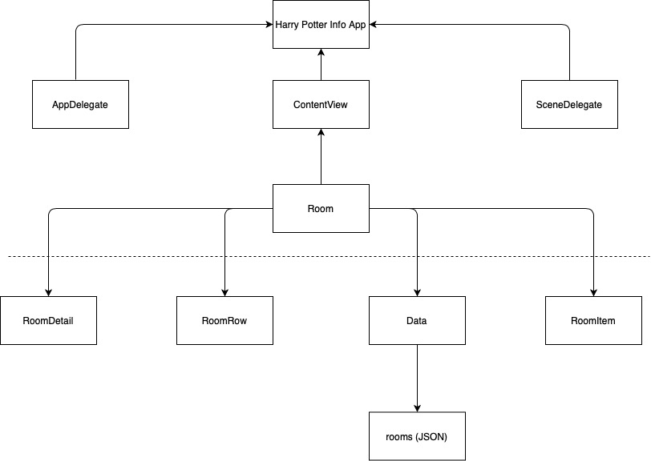

# SwiftUI-HarryPotter-Info

This project was created with Xcode version 11.3.1 and the SwiftUI Framework.
it's a simple app which I created with the help of the new SwiftUI framework.

. .

. 

## Diagram of the structure overview

.
